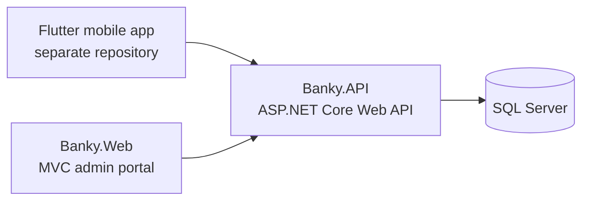

# #AbuD2023 Banky | Banking & Digital Wallet Platform

منصة مصرفية تعليمية مبنية على **ASP.NET Core و.NET 8**، تتكون من واجهة API لإدارة الحسابات والمحافظ والعمليات المالية، ولوحة ويب إدارية منفصلة. هذا المستودع خاص بالـ **ASP.NET API ولوحة الإدارة**؛ تطبيق الهاتف Flutter موجود في مستودع مستقل.

[مستودع تطبيق Flutter](https://github.com/AbuD2023/AbuD_Banky-OnlineBankingAndWallet--Flutter_Dart_Mobile_Phone) · [الترخيص](LICENSE) · [المساهمة](CONTRIBUTING.md)

## نظرة عامة

يقدم #AbuD2023 Banky نموذجًا عمليًا لمنظومة مصرفية متعددة الواجهات. تتولى `Banky.API` منطق الأعمال والتخزين والمصادقة، بينما تتصل بها `Banky.Web` لتقديم لوحة إدارة عبر MVC وRazor Views. كما يمكن لتطبيق Flutter المستقل استهلاك API نفسها.



## الوظائف

- التسجيل وتسجيل الدخول والمصادقة باستخدام JWT، مع تدفقات الحساب والتحقق من الهوية KYC.
- إنشاء المحافظ وعرض الأرصدة والعملات المتاحة.
- التحويلات بين المستخدمين عبر رقم الهاتف، مع معاينة الرسوم.
- التحويل بين محافظ المستخدم وحساب الصرف، إضافة إلى مدفوعات وإدارة نقاط البيع POS.
- سجل المعاملات، وإدارة العملاء والرسوم والعمليات الإدارية وعمليات الصراف.
- لوحة ويب إدارية تتصل بالـ API، مع مصادقة ملفات تعريف الارتباط.
- توثيق API تفاعلي عبر Swagger.

## مكونات المستودع

| المسار | الدور |
| --- | --- |
| `Banky.API` | REST API، خدمات الأعمال، المصادقة، وطبقة البيانات |
| `Banky.Web` | لوحة ويب إدارية باستخدام ASP.NET Core MVC وRazor Views |
| `Banky.slnx` | ملف الحل لتجميع مشاريع .NET |

## المتطلبات

- .NET 8 SDK
- SQL Server متاح محليًا أو عبر اتصال مهيأ
- Git

## التشغيل محليًا

استنسخ مستودع الخادم:

```bash
git clone https://github.com/AbuD2023/AbuD_Banky-OnlineBankingAndWallet--Razor-Pages-.NET-8-.git
cd AbuD_Banky-OnlineBankingAndWallet--Razor-Pages-.NET-8-
dotnet restore Banky.slnx
```

شغّل API في نافذة طرفية:

```bash
dotnet run --project Banky.API
```

ثم شغّل لوحة الإدارة في نافذة أخرى:

```bash
dotnet run --project Banky.Web
```

استخدم روابط التشغيل التي يعرضها `dotnet run`. توثيق API متاح على `/swagger` ضمن عنوان API.

## الإعداد والاتصال

- اضبط `ConnectionStrings:DefaultConnection` ليتصل API بقاعدة SQL Server الخاصة ببيئتك.
- اضبط `Jwt:Key` بقيمة سرية قوية وفريدة، واضبط `ApiSettings:BaseUrl` في إعدادات `Banky.Web` ليشير إلى عنوان API.
- استخدم متغيرات البيئة أو مخزن أسرار .NET للقيم الحساسة، ولا ترفع كلمات المرور أو مفاتيح JWT أو connection strings إلى GitHub.
- لتشغيل تطبيق الهاتف مع هذا الخادم، غيّر عنوان API في `lib/core/api_constants.dart` بمستودع Flutter إلى عنوان يمكن للهاتف أو المحاكي الوصول إليه.

## تطبيق الهاتف المرتبط

تطبيق Flutter هو **عميل منفصل** وليس جزءًا من هذا الحل .NET. يتطلب تشغيل وظائفه وجود نسخة متاحة ومتوافقة من `Banky.API`.

- [فتح مستودع تطبيق Flutter](https://github.com/AbuD2023/AbuD_Banky-OnlineBankingAndWallet--Flutter_Dart_Mobile_Phone)
- [فتح مستودع ASP.NET الحالي](https://github.com/AbuD2023/AbuD_Banky-OnlineBankingAndWallet--Razor-Pages-.NET-8-)

لتنزيل تطبيق الهاتف بجانب الخادم وتشغيله:

```bash
git clone https://github.com/AbuD2023/AbuD_Banky-OnlineBankingAndWallet--Flutter_Dart_Mobile_Phone.git
cd AbuD_Banky-OnlineBankingAndWallet--Flutter_Dart_Mobile_Phone
flutter pub get
```

بعد تشغيل `Banky.API`، اضبط `baseUrl` في `lib/core/api_constants.dart` داخل مستودع Flutter على عنوان API الذي يمكن للمحاكي أو الهاتف الوصول إليه، ثم شغّل `flutter run`. عنوان `localhost` من الهاتف الفعلي لا يشير إلى جهاز الخادم؛ استخدم عنوان الشبكة المحلية للجهاز، أو عنوان المحاكي المناسب. خطوات Flutter الكاملة موجودة في README الخاص بمستودعه.

## صور الواجهات

لقطات من لوحة الإدارة ووظائف النظام. قبل نشرها، تأكد من إخفاء أي بيانات شخصية أو مالية أو أسرار.

<table>
    <tr>
        <td align="center"><br><strong>الواجهة الرئيسية</strong><br>Admin dashboard</td>
        <td align="center"><br><strong>إدارة الموظفين وصلاحيات لوحة التحكم</strong><br>Staff and admin permissions</td>
    </tr>
    <tr>
        <td align="center"><br><strong>إدارة العملات</strong><br>Currency management</td>
        <td align="center"><br><strong>إدارة الرسوم والعمولات المصرفية (1)</strong><br>Banking fees and commissions (1)</td>
    </tr>
    <tr>
        <td align="center"><br><strong>إدارة الرسوم والعمولات المصرفية (2)</strong><br>Banking fees and commissions (2)</td>
        <td align="center"><br><strong>تفاصيل العميل</strong><br>Client details</td>
    </tr>
    <tr>
        <td align="center"><br><strong>تفاصيل الحركة المالية وبيانات الطرفين</strong><br>Transaction details and parties</td>
        <td align="center"><br><strong>سجل التدقيق والأنشطة الإدارية</strong><br>Audit log and admin activity</td>
    </tr>
    <tr>
        <td align="center"><br><strong>سجل العمليات والتحويلات العامة</strong><br>Transaction and transfer history</td>
        <td align="center"><br><strong>مكتب الصندوق - السحب والإيداع</strong><br>Teller deposits and withdrawals</td>
    </tr>
</table>

## الأمان والاستخدام

هذا المشروع نموذج تعليمي/تطبيقي، وليس نظامًا مصرفيًا معتمدًا لمعالجة أموال حقيقية. قبل جعل المستودع عامًا، افحص `Banky.API/appsettings.json`: لا ترفع مفاتيح JWT أو كلمات مرور أو connection strings حقيقية، واحذف أي قيمة مكشوفة من الملفات وسجل Git ثم دوّرها. استخدم .NET User Secrets محليًا أو متغيرات بيئة في النشر. يتطلب النشر الفعلي مراجعة أمنية مستقلة وإعداد HTTPS وCORS والتحقق من المصادقة والصلاحيات والعمليات المالية والبيانات الشخصية. لا تستخدم بيانات عملاء حقيقية.

## المساهمة والترخيص

راجع [CONTRIBUTING.md](CONTRIBUTING.md) لإعداد بيئة التطوير وإرسال التغييرات. المشروع مرخص وفق MIT؛ راجع [LICENSE](LICENSE).

---

## English

**#AbuD2023 Banky** is an educational banking and digital-wallet platform built with ASP.NET Core and .NET 8. This repository contains a REST API (`Banky.API`) backed by SQL Server and an MVC/Razor Views administration portal (`Banky.Web`). A separate Flutter mobile client consumes the API.

### Highlights

- JWT authentication, account workflows, and KYC submission.
- Multi-currency wallets, phone-based transfers, fee previews, and self-exchange.
- POS point management and payments, transaction history, and administrative/teller workflows.
- Swagger API documentation and a separate cookie-authenticated web portal.

### Quick start

Requirements: .NET 8 SDK and SQL Server. Clone the repository and start the API and web portal in separate terminals:

```bash
git clone https://github.com/AbuD2023/AbuD_Banky-OnlineBankingAndWallet--Razor-Pages-.NET-8-.git
cd AbuD_Banky-OnlineBankingAndWallet--Razor-Pages-.NET-8-
dotnet restore Banky.slnx
dotnet run --project Banky.API
```

```bash
dotnet run --project Banky.Web
```

Configure the SQL Server connection, a strong JWT signing key, and the web portal's API base URL for your environment. The API Swagger UI is available at `/swagger` on the API host.

### Related project

The mobile client is maintained separately: [#AbuD2023 Banky Flutter Mobile App](https://github.com/AbuD2023/AbuD_Banky-OnlineBankingAndWallet--Flutter_Dart_Mobile_Phone). It requires a reachable, compatible `Banky.API` instance.

### GitHub discovery

Suggested repository description: **ASP.NET Core .NET 8 banking platform with a REST API, SQL Server, and admin portal for wallets, transfers, POS, KYC, and transactions.**

Suggested topics: `aspnet-core`, `dotnet`, `dotnet8`, `csharp`, `web-api`, `sql-server`, `digital-wallet`, `banking`, `fintech`, `point-of-sale`.

To apply these on GitHub, open the repository page, select the **About** gear, enter the description, and add the topics above. Add the Flutter repository URL to the Website field so visitors can find the client. For a Social Preview, open **Settings > General > Social preview** and upload a project-branded image (1280 x 640 px recommended). The UI screenshots above are stored under `docs/screenshots/`. Keep the description and topics specific to this ASP.NET repository; do not add unrelated keywords.

### Security notice

This is an educational/sample project, not a certified production banking system. Do not process real funds or real customer data without a thorough security, privacy, and operational review.


